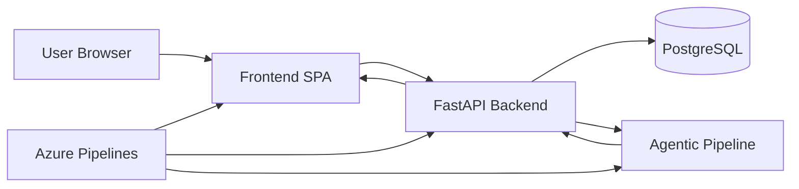
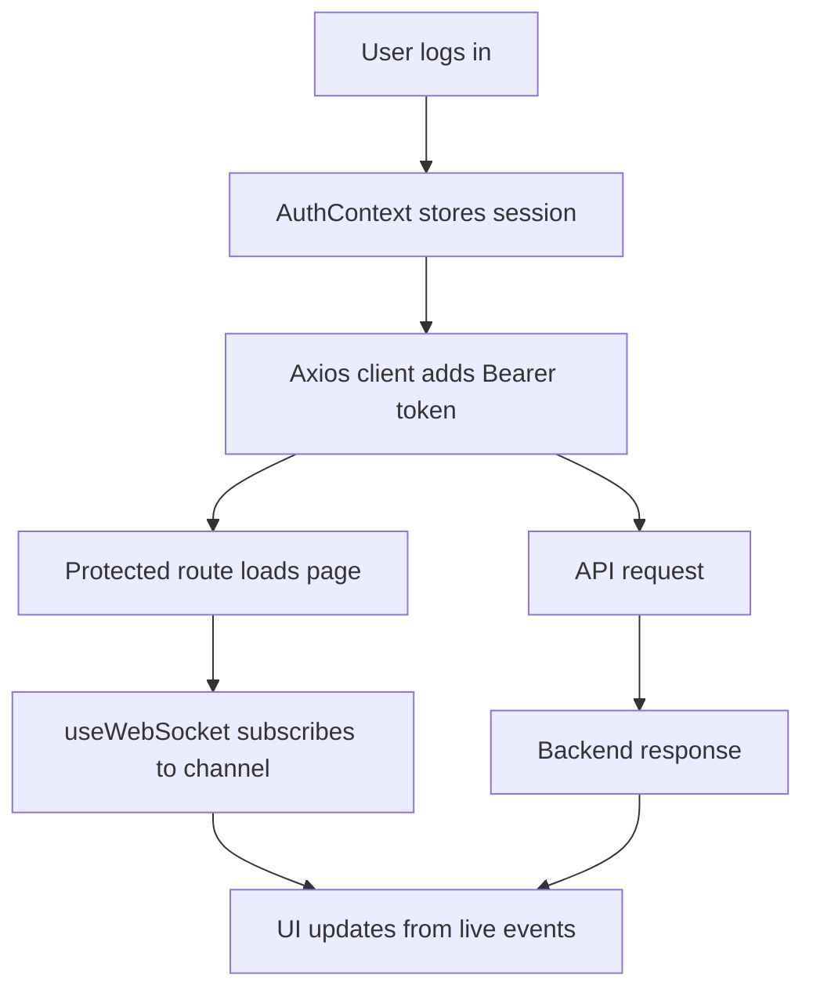
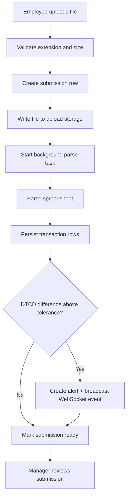
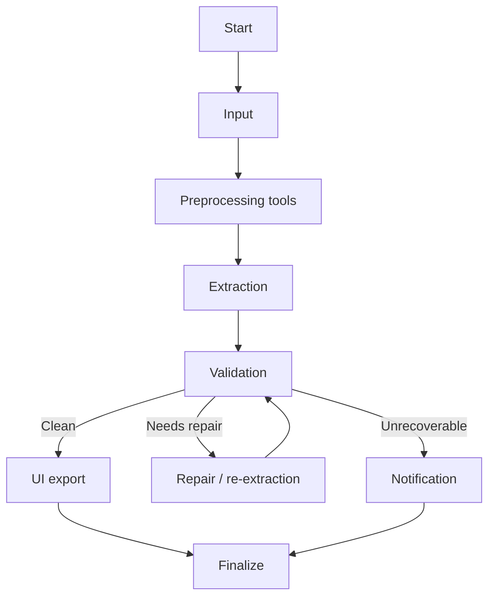
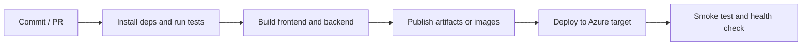

# LedgerFlow

LedgerFlow is a financial workflow platform with three distinct parts:

1. A React front-end for employees, managers, and admins.
2. A FastAPI back-end that owns authentication, uploads, reviews, alerts, audit logging, and analytics.
3. A LangGraph-based agentic pipeline that extracts, validates, repairs, and exports general-ledger data.

There is also a separate CI/CD layer. In this repository, the Azure Pipelines stack should be understood as deployment automation, not as part of the runtime application itself.

## At A Glance



The important separation is:

- Frontend = what the user sees and interacts with.
- Backend = the system of record and business rules.
- Agentic pipeline = extraction and repair automation.
- Azure Pipelines = build, test, package, and deploy automation.

## Repository Layout

- `frontend/` - React application, routes, pages, components, styles, auth state, API client
- `backend/` - FastAPI application, routers, services, models, schemas, migrations
- `ledgerflow_agent/` - LangGraph state machine, routing, prompts, memory, orchestration
- `agents/` - Individual agent workers for input, extraction, validation, repair, UI export, notifications
- `tools/` - Deterministic spreadsheet, mapping, and financial logic helpers
- `graph/` - Mermaid source and rendered graph assets
- `tests/` - Pytest coverage for routing, validation, utilities, and integration
- `docs/` - Architecture and deployment reference material

## How The Product Works

LedgerFlow manages a general-ledger submission from first upload to final review:

1. An employee uploads a spreadsheet.
2. The backend saves the file, validates the structure, and parses the rows.
3. The user sees a preview and transaction details in the UI.
4. The manager reviews the submission, comments, approves, rejects, or requests a re-upload.
5. The system logs actions, raises alerts for imbalance, and streams updates over WebSockets.
6. The agentic pipeline can optionally process messy source data first and produce verified outputs.

## Front-End Stack

The front-end lives in `frontend/` and is a single-page application built with:

- React 19
- Vite
- React Router
- Tailwind CSS
- Axios
- React Icons
- Recharts
- date-fns
- React Day Picker

### Front-End Responsibilities

The front-end is responsible for presentation, routing, and user interaction. It does not own the business rules.

- It shows the landing page, login page, dashboards, uploads, alerts, settings, and audit views.
- It stores the active session in `localStorage` under `ledgerflow_auth`.
- It sends API requests through a shared Axios client.
- It listens to WebSocket channels for upload progress, dashboard refreshes, comment updates, and approval events.
- It renders role-specific pages for employees, managers, and admins.

### Front-End Core Files

- `frontend/src/main.jsx` - application bootstrap, router tree, role-protected routes
- `frontend/src/auth/AuthContext.jsx` - login, logout, session restore, token refresh
- `frontend/src/auth/ProtectedRoute.jsx` - route guard for role-based access
- `frontend/src/api/client.js` - Axios client with bearer token support and refresh handling
- `frontend/src/hooks/useWebSocket.js` - WebSocket subscription helper
- `frontend/src/shell/AppShell.jsx` - authenticated layout, navigation, shell chrome
- `frontend/src/pages/*.jsx` - page-level screens
- `frontend/src/components/*.jsx` - reusable UI components
- `frontend/src/styles.css` - global styling and layout rules

### Front-End Pages

- `LandingPage.jsx` - public entry page, redirects authenticated users
- `AuthPage.jsx` - login and registration flow
- `Dashboard.jsx` - analytics, charts, KPI cards, recent activity
- `UploadCenter.jsx` - upload form, file validation, preview, progress state
- `SubmissionsPage.jsx` - submission history, comments, transaction modal, version tracking
- `ManagerDashboard.jsx` - review queue, comment thread, approval actions
- `AlertsPage.jsx` - alert list, search, filtering, read/unread workflow
- `SettingsPage.jsx` - profile update, password change, session controls
- `AdminDashboard.jsx` - manager assignment and reassignment
- `AuditPage.jsx` - immutable audit log browser

### Front-End Data Flow



What this means in practice:

- The UI does not talk to the database directly.
- Authentication state is restored from the browser session on reload.
- Protected routes decide which pages are visible based on the user role.
- WebSocket events keep uploads, dashboards, comments, and review queues current without manual refresh.

## Back-End Stack

The back-end lives in `backend/` and is built with:

- FastAPI
- SQLAlchemy 2.x async
- Pydantic
- asyncpg
- Alembic
- Pandas
- OpenPyXL
- Uvicorn
- python-jose
- passlib
- python-dotenv
- WebSockets

### Back-End Responsibilities

The backend is the authoritative layer for security and business rules.

- It registers users and issues JWT access tokens plus refresh-token cookies.
- It enforces role-based access control.
- It accepts file uploads and starts background parsing work.
- It stores submissions, transaction rows, alerts, comments, reviews, and audit logs.
- It exposes analytics, approval, comments, alerts, admin, and audit endpoints.
- It broadcasts WebSocket updates for live UI synchronization.

### Back-End Core Files

- `backend/app/main.py` - FastAPI app setup, CORS, router registration, startup seeding
- `backend/app/core/config.py` - environment-backed settings
- `backend/app/core/security.py` - password hashing, JWT, refresh-token handling, role checks
- `backend/app/db/session.py` - async session and engine wiring
- `backend/app/models.py` - SQLAlchemy models
- `backend/app/schemas.py` - request and response contracts
- `backend/app/services/excel_parser.py` - spreadsheet parsing and normalization
- `backend/app/services/email.py` - SMTP notifications and manager links
- `backend/app/services/websocket_manager.py` - in-memory live event broadcasting
- `backend/app/api/*.py` - HTTP routers

### Back-End Routers

- `auth.py` - register, login, refresh, logout, profile, password change
- `uploads.py` - upload, re-upload, preview, transaction listing, version history
- `comments.py` - submission comment threads
- `approvals.py` - approve, reject, request re-upload, review token verification
- `alerts.py` - alert listing, creation, read tracking, enrichment
- `admin.py` - manager and employee assignment
- `audit.py` - audit log retrieval
- `analytics.py` - KPI aggregation and trends
- `websockets.py` - channel management and broadcasts

### Back-End Upload Flow



Important upload behavior:

- Uploads are asynchronous after the raw file is saved.
- The UI gets progress and status updates through WebSockets.
- Parsed rows are stored as `transaction_rows`.
- Non-zero balance differences can create alerts.
- Re-uploads are versioned, not overwritten.
- The backend is the final source of truth for access checks and review state.

### Main Data Model

- `users` - account identity, role, manager assignment
- `refresh_tokens` - hashed refresh tokens
- `submissions` - upload metadata, versioning, status, file path
- `submission_comments` - review thread messages
- `reviews` - manager decision records
- `transaction_rows` - parsed general-ledger rows
- `alerts` - validation and DTCD alert records
- `audit_logs` - immutable system action history

## Agentic Pipeline Stack

The agentic pipeline is the automation layer for messy source data. It is not the same thing as the frontend or the backend. It exists to turn raw text, email bodies, attachments, or unstructured spreadsheets into verified structured ledger data.

It is built from:

- LangGraph
- ReAct-style agents
- Groq-backed LLM extraction
- Deterministic spreadsheet tools
- Financial validation rules
- Repair and re-extraction loops

### Pipeline Files

- `ledgerflow_agent/graph.py` - graph construction and compilation
- `ledgerflow_agent/nodes.py` - node implementations and routing hooks
- `ledgerflow_agent/state.py` - shared state definition
- `ledgerflow_agent/routing.py` - routing decisions
- `ledgerflow_agent/prompts.py` - prompt registry
- `ledgerflow_agent/registry.py` - tool registry
- `ledgerflow_agent/tool_policy.py` - tool permissions
- `ledgerflow_agent/guardrails.py` - safety and sanitization
- `ledgerflow_agent/memory.py` - runtime memory persistence
- `ledgerflow_agent/executor.py` - execution helpers
- `ledgerflow_agent/orchestrator.py` - orchestration entry points
- `agents/*.py` - specialized agent workers
- `tools/*.py` - deterministic helper tools

### Pipeline Node Flow



### What Each Pipeline Stage Does

- `input` - fetches source text or uses a local-file bypass when configured
- `preprocessing` - normalizes sheet selection, field mapping, and financial rules
- `extraction` - converts raw content into structured transaction JSON
- `validation` - checks required fields, schema shape, and accounting balance
- `repair` - fixes specific fields instead of rerunning the entire extraction
- `ui` - writes `verified_data.json` and `verified_data.xlsx`
- `notification` - sends failure notifications and manual-review alerts
- `finalize` - stores memory and closes the run

### Pipeline Behavior That Matters

- The workflow uses a retry limit from `project_config.yml`.
- The pipeline prefers deterministic tools first and uses LLMs where reasoning is needed.
- Validation is the gatekeeper for whether data can move forward.
- Repair loops are targeted, not a full restart of the pipeline.
- Runtime memory is persisted so the agent can track previous runs.
- The exported verified files are runtime artifacts, not source code.

### Pipeline Inputs And Outputs

Typical inputs:

- raw email text
- spreadsheet content
- local file path through `LOCAL_FILE`

Typical outputs:

- structured transaction JSON
- `verified_data.json`
- `verified_data.xlsx`
- validation and repair metadata
- UI or email notifications for failures

### Optional Backend Integration With The Pipeline

The backend upload route supports an optional `use_agents=true` query parameter. When enabled, the uploaded file can be routed through the agentic pipeline before normal parsing finishes.

That means:

- the browser still uses the backend upload API
- the backend still owns submission state
- the pipeline can improve or repair the file content before storage
- the final data still lands in the backend and UI workflows

## Azure Pipelines / CI-CD Stack

This is the deployment automation layer. It is separate from the runtime application and separate from the agentic extraction pipeline.

Pipeline definition:

- `azure-pipelines.yml` - Azure DevOps CI pipeline for backend tests, pipeline checks, and frontend build output

If you wire this repo into Azure DevOps, the normal stage structure is:



### Typical Azure Services For This Repo

- Azure Repos or GitHub as the source control provider
- Azure Pipelines for build and release automation
- Azure Container Registry for images
- Azure App Service or Azure Container Apps for deployment
- Azure Database for PostgreSQL for the database
- Azure Key Vault for secrets
- Azure Storage for file artifacts, if you externalize uploads

### Typical Azure Pipeline Jobs

- Frontend job:
  - install Node dependencies
  - run `npm run build`
  - publish the frontend build output
- Backend job:
  - install Python dependencies
  - run backend checks and tests
  - package the FastAPI application
- Integration job:
  - verify backend and frontend can talk to each other
  - confirm environment variables are present
  - run smoke tests against deployed endpoints

### Why This Section Exists

New contributors often confuse application pipelines with CI/CD pipelines. They are different:

- The application pipeline processes financial data at runtime.
- Azure Pipelines builds, tests, and deploys the application.

## Local Development

### Prerequisites

- Python 3.10+
- Node.js 18+
- PostgreSQL 16
- Docker and Docker Compose

### Full Stack With Docker

```powershell
docker compose up --build
```

### Run The Backend By Itself

```powershell
Copy-Item backend\.env.example backend\.env
cd backend
py -3 -m venv .venv
.\.venv\Scripts\Activate.ps1
pip install -r requirements.txt
uvicorn app.main:app --reload --port 8000
```

### Run The Frontend By Itself

```powershell
cd frontend
npm install
npm run dev
```

### Run The Agent Pipeline Directly

```powershell
py -3 main.py
```

### Local URLs

- Frontend: `http://localhost:5173`
- Backend: `http://localhost:8000`
- PostgreSQL host port: `5433`

## Environment Variables

Backend settings are defined in `backend/.env.example` and `backend/app/core/config.py`.

Common variables:

```text
DATABASE_URL
JWT_SECRET_KEY
JWT_ALGORITHM
ACCESS_TOKEN_EXPIRE_MINUTES
MAX_UPLOAD_SIZE_MB
MAX_PREVIEW_ROWS
CORS_ORIGINS
FRONTEND_BASE_URL
DEFAULT_ADMIN_EMAIL
DEFAULT_ADMIN_PASSWORD
EMAILS_ENABLED
SMTP_HOST
SMTP_PORT
UPLOAD_DIR
```

Pipeline-related variables often include:

```text
LOCAL_FILE
SKIP_HTTP_UPLOAD
OUTPUT_JSON_FILE
OUTPUT_EXCEL_FILE
AGENT_EMAIL
AGENT_PASSWORD
```

## API Surface

### Auth

- `POST /api/auth/register`
- `POST /api/auth/login`
- `POST /api/auth/refresh`
- `POST /api/auth/logout`
- `GET /api/auth/me`
- `PATCH /api/auth/me`
- `POST /api/auth/change-password`

### Uploads

- `POST /api/uploads`
- `GET /api/uploads`
- `GET /api/uploads/{upload_id}`
- `GET /api/uploads/{upload_id}/transactions`
- `POST /api/uploads/{submission_id}/reupload`

### Comments

- `GET /api/submissions/{submission_id}/comments`
- `POST /api/submissions/{submission_id}/comments`

### Approvals

- `POST /api/approvals/approve`
- `POST /api/approvals/reject`
- `POST /api/approvals/request-reupload`
- `GET /api/approvals/verify-token?token=...`

### Alerts

- `GET /api/alerts`
- `POST /api/alerts`
- `PATCH /api/alerts/{alert_id}/read`
- `PATCH /api/alerts/read-all`

### Analytics

- `GET /api/analytics/kpis`

### Audit

- `GET /api/audit`

### Admin

- `GET /api/admin/managers`
- `GET /api/admin/employees`
- `POST /api/admin/assign`
- `POST /api/admin/reassign`

## WebSocket Channels

Current channels:

- `uploads`
- `manager`
- `dashboard`
- `comments`
- `submissions`

Common events:

- `upload_progress`
- `upload.complete`
- `upload.failed`
- `upload.processing`
- `new_comment`
- `approval.decision`
- `dashboard_refresh`
- `new_upload`
- `dtcd_alert`

## Glossary

- Upload - the raw file or source payload sent into the backend.
- Submission - a tracked workflow record for one upload, including versioning and review state.
- Transaction row - one parsed ledger line stored in the database.
- DTCD - debit-credit difference.
- Re-upload - a new version of an existing submission after manager request.
- Verified output - cleaned data that passed the pipeline and was exported for downstream use.

## Documentation

- [docs/ARCHITECTURE.md](docs/ARCHITECTURE.md)
- [docs/RAILWAY_DEPLOYMENT.md](docs/RAILWAY_DEPLOYMENT.md)
- [DESIGN_SYSTEM.md](DESIGN_SYSTEM.md)
- [DESIGN_QUICK_REFERENCE.md](DESIGN_QUICK_REFERENCE.md)
- [agent.md](agent.md)
