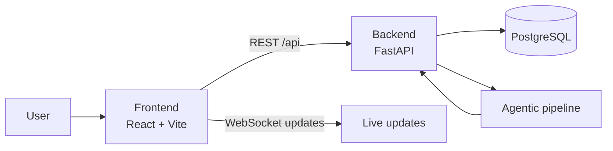

# LedgerFlow

LedgerFlow turns general-ledger spreadsheet submissions into structured, reviewable workflows.

It is built for teams that need to upload XLSX or CSV files, validate financial data, route it through manager review, and keep a clear audit trail without relying on ad hoc spreadsheets or email threads.

## What It Solves

- Removes manual follow-up from spreadsheet-based financial submissions.
- Handles inconsistent ledger file layouts without forcing every upload into the same rigid template.
- Keeps uploads, approvals, alerts, and audit logs in one place.
- Supports live status updates instead of manual refresh.
- Provides an optional agentic pipeline for messy or unstructured source data.

## Key Features

- Spreadsheet uploads with validation and parsing
- Submission preview and transaction detail views
- Manager approve, reject, and re-upload workflow
- Comments, alerts, audit logs, and analytics
- Role-based access for employees, managers, and admins
- Optional agent-assisted extraction and repair

## Project Layers

- `frontend/` - React app for uploads, submissions, dashboards, alerts, settings, and admin screens.
- `backend/` - FastAPI API, authentication, persistence, approvals, analytics, and WebSocket updates.
- `ledgerflow_agent/` and `agents/` - optional LangGraph-based extraction and repair pipeline.
- `docs/` - architecture and deployment references.
- `tests/` - automated test coverage.

## Architecture Overview



The important separation is:

- Frontend = presentation and user interaction.
- Backend = system of record and business rules.
- Agentic pipeline = optional extraction and repair automation.

## How The Product Works

1. An employee uploads a spreadsheet.
2. The backend validates the file and creates a submission.
3. Parsed transactions are stored and shown in the UI.
4. A manager reviews the submission and leaves a decision.
5. Alerts, audit logs, and analytics update from the same backend state.

## Frontend

The frontend is a React single-page app. It handles presentation, routing, and user interaction, and it stays in sync with backend events.

Main screens:

- Landing and authentication
- Upload center
- Submissions history and transaction detail views
- Manager review dashboard
- Alerts, settings, admin, and audit pages

## Backend

The backend is the system of record. It owns authentication, role-based access, upload processing, approval decisions, comments, analytics, and notifications.

Main responsibilities:

- Registering and authenticating users
- Storing submission metadata and transaction rows
- Enforcing manager and admin access rules
- Tracking review state, alerts, and audit logs
- Broadcasting live updates to the UI

## Agentic Pipeline

The optional agentic pipeline helps process messy inputs, repair problematic data, and produce verified structured output when deterministic parsing is not enough.

## Quick Start

### Docker Compose

```powershell
docker compose up --build
```

### Backend Only

```powershell
Copy-Item backend\.env.example backend\.env
cd backend
py -3 -m venv .venv
.\.venv\Scripts\Activate.ps1
pip install -r requirements.txt
uvicorn app.main:app --reload --port 8000
```

### Frontend Only

```powershell
cd frontend
npm install
npm run dev
```

### Optional Agent Run

```powershell
py -3 main.py
```

## Configuration

Start with `backend/.env.example`. Common settings include:

- `DATABASE_URL`
- `JWT_SECRET_KEY`
- `CORS_ORIGINS`
- `FRONTEND_BASE_URL`
- `DEFAULT_ADMIN_EMAIL`
- `DEFAULT_ADMIN_PASSWORD`
- `EMAILS_ENABLED`
- `UPLOAD_DIR`

## Documentation

- [Architecture](docs/ARCHITECTURE.md)
- [Railway deployment](docs/RAILWAY_DEPLOYMENT.md)
- [Testing guide](TESTING_GUIDE.md)
- [Agent notes](agent.md)
